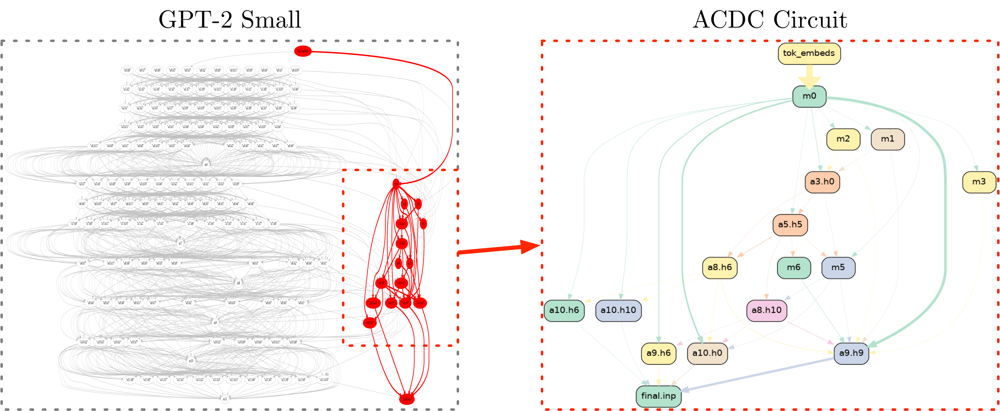

[]() 

# Automatic Circuit DisCovery 



This is a minor modification to the code in (https://github.com/ArthurConmy/Automatic-Circuit-Discovery) by Arthur Conmy that accompanied the paper ["Towards Automated Circuit Discovery for Mechanistic Interpretability"](https://arxiv.org/abs/2304.14997) (NeurIPS 2023 Spotlight).

* :wrench: To see how edit edges in computational graphs in models, see `notebooks/editing_edges.py` or <a href="https://colab.research.google.com/github/ArthurConmy/Automatic-Circuit-Discovery/blob/main/notebooks/colabs/ACDC_Editing_Edges_Demo.ipynb">this Colab notebook</a>
* :sparkle: To understand the low-level implementation of completely editable computational graphs, see <a href="https://colab.research.google.com/github/ArthurConmy/Automatic-Circuit-Discovery/blob/main/notebooks/colabs/ACDC_Implementation_Demo.ipynb">this Colab notebook</a> or `notebooks/implementation_demo.py`

This library builds upon the abstractions (`HookPoint`s and standardised `HookedTransformer`s) from [TransformerLens](https://github.com/neelnanda-io/TransformerLens) :mag_right:


## Citing ACDC

If you use ACDC, please reach out! You can reference the work as follows:

```
@inproceedings{conmy2023automated,
      title={Towards Automated Circuit Discovery for Mechanistic Interpretability}, 
      author={Arthur Conmy and Augustine N. Mavor-Parker and Aengus Lynch and Stefan Heimersheim and Adri{\`a} Garriga-Alonso},
      booktitle={Thirty-seventh Conference on Neural Information Processing Systems},
      year={2023},
      eprint={2304.14997},
      archivePrefix={arXiv},
      primaryClass={cs.LG}
}
```
